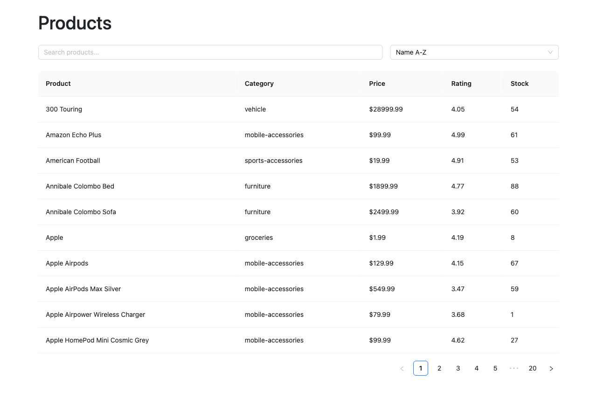

# Product Browser

A single-page product browser built with React, Redux Toolkit and RTK Query, backed by the public [DummyJSON](https://dummyjson.com/) products API.



## Features

- **Search**: debounced (300ms) full-text search via DummyJSON's `products/search` endpoint
- **Sorting**: by name, price or rating, ascending or descending
- **Server-side pagination**: 10 products per page, fetched with `skip`/`limit`
- **Loading, error and empty states**

## Tech stack

- [React 19](https://react.dev/) + [Vite](https://vite.dev/)
- [Redux Toolkit](https://redux-toolkit.js.org/) with [RTK Query](https://redux-toolkit.js.org/rtk-query/overview) for data fetching and caching
- [Ant Design](https://ant.design/) for UI components (`Table`, `Input`, `Select`, `Alert`)
- [Bootstrap](https://getbootstrap.com/) CSS for layout and spacing

## Getting started

Requires Node.js 20+.

```bash
npm install
npm run dev
```

Then open the URL Vite prints (usually http://localhost:5173).

## Scripts

| Command           | Description                         |
| ----------------- | ----------------------------------- |
| `npm run dev`     | Start the dev server with HMR       |
| `npm run build`   | Production build to `dist/`         |
| `npm run preview` | Serve the production build locally  |
| `npm run lint`    | Run ESLint                          |

## Project structure

```
src/
├── app/store.js                     # Redux store: filters reducer + RTK Query API
├── features/filters/filterSlice.js  # UI query state: search, sortBy, order, page
├── services/productsApi.js          # RTK Query API for DummyJSON products
├── App.jsx                          # Search, sort and paginated product table
└── main.jsx                         # Entry point, Redux Provider, global CSS
```

## How it works

1. `filterSlice` holds the current `search`, `sortBy`, `order` and `page`. Changing the search or sort resets the page to 1.
2. `App.jsx` reads the filters from the store and passes them to `useGetProductsQuery`.
3. `productsApi` calls `products/search?q=...` when a search term is set and `products` otherwise, converting `page`/`limit` into DummyJSON's `skip`/`limit`.
4. RTK Query caches each unique combination of query args, so revisiting a page or sort is instant.
